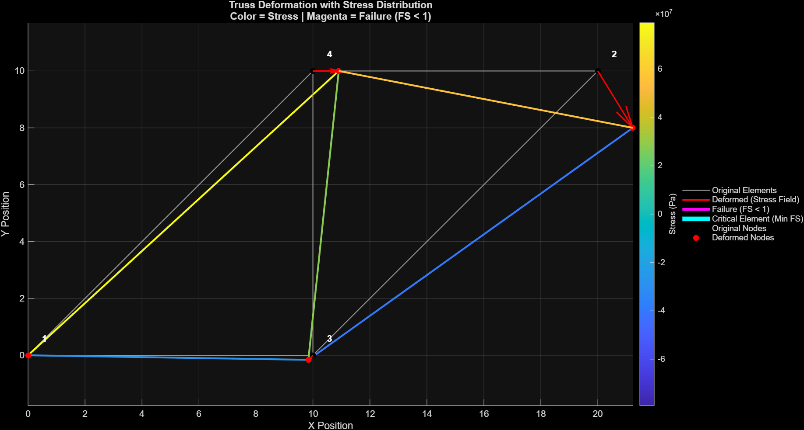
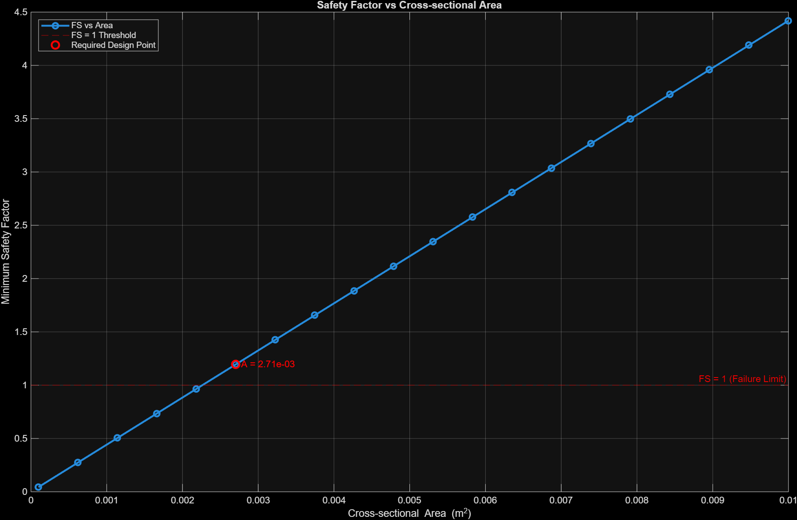
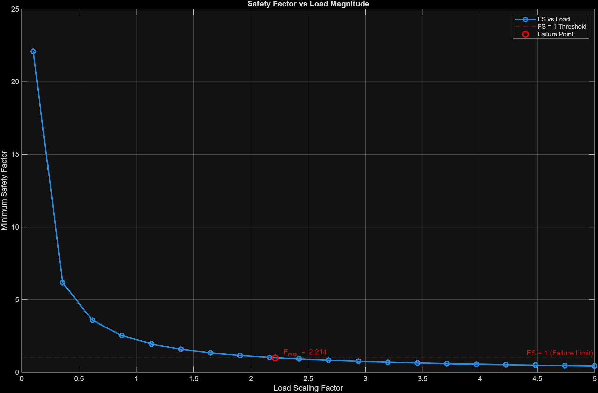

# Noah Imel

Mechanical Engineering student at Arizona State University focused on **computational mechanics**, including finite element analysis (FEA) and computational fluid dynamics (CFD).

Experienced in developing and validating **numerical models** using MATLAB, with an emphasis on structural analysis, parametric studies, and engineering simulation.

---

## Technical Skills

**Tools & Software**

* MATLAB
* ANSYS
* SolidWorks (CSWA expected Dec 2026)

**Engineering Focus**

* Finite Element Analysis (FEA)
* Computational Fluid Dynamics (CFD)
* Structural Analysis

**Methods**

* Direct stiffness method
* Parametric analysis
* Linear systems & matrix assembly

---

## Projects

### [Structural FEA Solver](https://github.com/noah-imel/structural-fea-solver)

* Developed a modular 2D truss FEA solver using the direct stiffness method
* Implemented global stiffness matrix assembly via DOF mapping (Ku = F)
* Conducted parametric studies (20+ cases), identifying failure at **2.2× design load**
* Evaluated relationships between safety factor, force, and cross-sectional area
* Validated displacements and internal forces against analytical solutions; verified equilibrium

**Example Output:**

---

### [Beam Stress Analysis](https://github.com/noah-imel/beam-stress-analysis)

* Modeled bending stress and deflection using Euler–Bernoulli beam theory
* Identified non-physical stress results (~3000 MPa, ~12× yield), diagnosing breakdown of small-deflection assumptions
* Validated deflection results against closed-form solutions
* Generated stress and deflection plots with yield comparisons

**Example Output:**

---

## Interests

* Structural analysis
* Fluid dynamics
* Engineering simulation

---

## Contact

* LinkedIn: linkedin.com/in/noahimel
* Email: [noahimel.1006@gmail.com](mailto:noahimel.1006@gmail.com)
